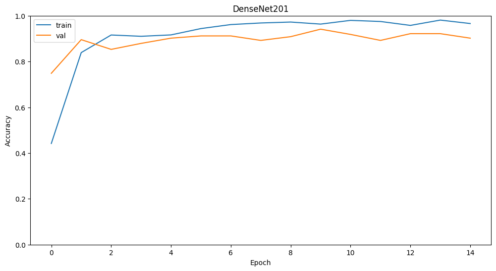
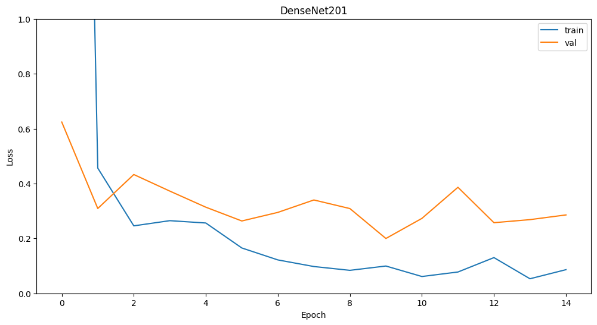

# Recognizing Functional Signs in Ocular Diseases via Transfer Learning


<p align="center">
  
</p>

## Overview

This project was originally developed in **August 2023** as a high school science and engineering research project (Ho Chi Minh City Department of Education and Training — Science & Engineering Fair for High School Students, 2023–2024, Project code `21_1033_09`, Software Systems category).

It pairs a **transfer-learning-based convolutional neural network** with a **clinically-grounded symptom questionnaire** to give users an at-home, preliminary screening suggestion for common eye conditions — aiming to lower the barrier for people who might otherwise delay seeking medical attention due to cost, distance, or simply not recognizing early warning signs.

## Motivation

According to the World Health Organization, roughly 2 billion people worldwide live with a vision-impairing condition, and an estimated 1 billion of those cases involve preventable or not-yet-addressed deterioration. In Vietnam specifically, an estimated 2 million people are affected by blindness or serious eye disease, a number compounded by recurring conjunctivitis (pink eye) outbreaks. Many people either underestimate early symptoms or lack easy, affordable access to specialist care. This project explores whether a lightweight, web-based AI tool can help close that gap.

## How It Works

```
 Photo input  →  Image preprocessing  →  CNN disease classification
                                                 │
                                                 ▼
                                     Functional-symptom questionnaire
                                                 │
                                                 ▼
                 Combined suggestion + condition info + at-home guidance
```

1. **Capture or upload** a close-up photo of the eye.
2. The image is preprocessed and passed through a **fine-tuned CNN** (transfer learning) that classifies it into one of six conditions (or a healthy eye).
3. Based on the predicted class, the user answers a short, **condition-specific questionnaire** derived with the guidance of a licensed ophthalmologist and a professional ophthalmology reference manual.
4. The app combines both signals to produce a **severity-aware suggestion**, background information about the condition, and **at-home care / red-flag guidance**.

## Model & Methodology

- **Approach:** Transfer learning on five ImageNet-pretrained backbones — **VGG16, VGG19, DenseNet201, Xception, ResNet152**
- **Input size:** 180×180 RGB
- **Dataset:** 3,076 curated images across 5 image classes (healthy, red/inflamed eye, cataract, subconjunctival hemorrhage, pterygium), collected from peer-reviewed sources and major ophthalmology portals, with clinical label verification by an ophthalmologist.
- **Training environment:** Google Colaboratory.

Model comparison after training:

| Model | Best epoch | Validation accuracy | Validation loss | Avg. time / epoch |
|---|---|---|---|---|
| VGG16 | 19 | 88.89% | 0.4663 | 76s |
| VGG19 | 19 | 86.27% | 0.5479 | 81s |
| **DenseNet201** | **10** | **94.12%** | **0.19** | 82s |
| Xception | 20 | 87.25% | 0.4733 | 96s |
| ResNet152 | 20 | 49.35% | 1.2645 | 89s |

**DenseNet201** was selected for its best validation accuracy and lowest validation loss.

## Results

<p align="center">
  
  
</p>

DenseNet201's accuracy and loss curves stabilize after epoch 2, with validation accuracy consistently above 90% and validation loss settling around 0.19–0.29 — indicating good generalization for the size of the dataset.

## Limitations & Disclaimer

This tool is a **student research project**, not a certified medical device. It is intended to raise awareness and encourage timely medical consultation — **not** to replace diagnosis by a licensed ophthalmologist. Predictions should always be verified by a qualified healthcare professional, especially before making any treatment decisions.

## Acknowledgments

- **Ths. Bs. Trần Thủy Trinh** — Ophthalmology Department, Thu Duc City Hospital, for clinical guidance on symptom classification, label verification, and questionnaire design throughout the project.
- **Ho Chi Minh City Eye Hospital**, whose internal *"Cẩm Nang Thực Hành Nhãn Khoa"* (Practical Ophthalmology Handbook) informed the design of the symptom questionnaire. This reference document is for internal clinical use and is **not redistributed** in this repository.